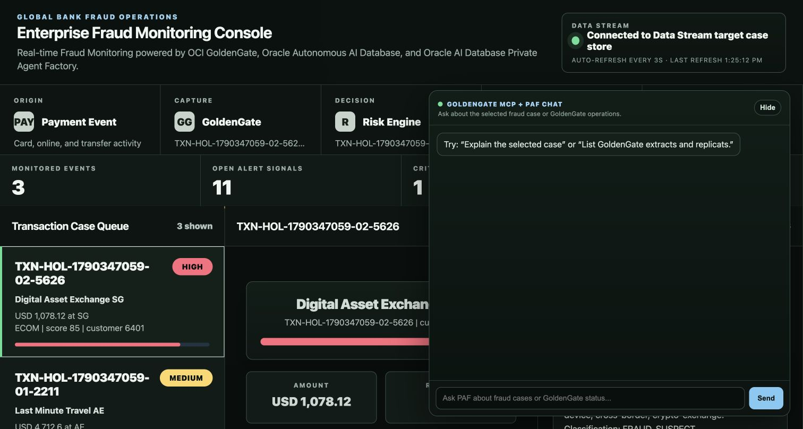

# Lab 1: Review and access the environment resources

## Introduction

In this lab, you review the resources created in the LiveLabs Sandbox such as the OCI GoldenGate deployment and its connection, and access the Enterprise Fraud Monitoring Console and its backend OCI Compute instance.

Estimated time: 10 minutes

### About Oracle Cloud Infrastructure GoldenGate deployments and connections

An Oracle Cloud Infrastructure GoldenGate deployment manages the resources it requires to function. The GoldenGate deployment also lets you access the GoldenGate deployment console, where you can access the OCI GoldenGate deployment console to create and manage processes such as Extracts and Replicats.

Connections store the source and target credential information for OCI GoldenGate. A connection also enables networking between the Oracle Cloud Infrastructure (OCI) GoldenGate service tenancy virtual cloud network (VCN) and your tenancy VCN using a private endpoint.

### Objectives

In this lab, you learn to:

- Review the OCI GoldenGate deployment
- Review and test the OCI GoldenGate source connection
- Connect to the Enterprise Fraud Monitoring Console
- Access the Enterprise Fraud Monitoring Console backend

## Task 1: Review the OCI GoldenGate deployment and connection

1. In the Oracle Cloud console, open the __navigation menu__, navigate to __Oracle AI Database__, and then select __GoldenGate__.

2. If you're prompted to take a tour, you can choose to continue with the tour or close it.

3. On the GoldenGate __Overview__ page, if you encounter a "Failed to load" error about your resources, select your assigned __Compartment__ from the __Applied filters__ dropdown.

__NOTE__: If you're using the LiveLab Sandbox environment, you can find your compartment number in the Reservation Information panel (View Login Info) of the workshop instructions.

4. In the GoldenGate menu page, click __Deployments__.

__NOTE__: If using the LiveLab Sandbox environment, select your LiveLab compartment from the Applied filters dropdown.

5. Select __OCI-GoldenGate-Deployment__ in the Deployments list.

You can perform the following actions on the deployment details page:

- Review the deployment's status
- Launch the GoldenGate service deployment console
- Edit the deployment's name or description
- Stop and start the deployment
- Move the deployment to a different compartment
- Review the deployment resource information
- Add tags

6. Click __Assigned connections__.

7. Locate the __ATP Fraud Source Connection__ under __Other assigned connections__ at the bottom of the screen.

8. Open the connection's __Actions__ menu, and then select __Test connection__.

__NOTE__: The test is successful if you see "Connectivity test passed successfully.". Click Test connection again if the test fails. 

You can also access the deployment console directly using the URL provided on the LiveLabs Sandbox login page.

## Task 2: Connect to the Enterprise Fraud Monitoring Console

1. Find the **Fraud Dashboard URL** on the __LiveLabs Sandbox login page__.

2. Open the link or copy and paste it in your laptop browser and connect to the **Enterprise Fraud Monitoring Console**.

3. The __Enterprise Fraud Monitoring Console__ is a custom application built for this workshop to trace a new transaction through capture, streaming, storage, risk scoring, and analysis.

4. You will use the __GoldenGate MCP + PAF Chat__ panel to interact with OCI GoldenGate using the GoldenGate MCP server.

The following image shows the Enterprise Fraud Monitoring Console connected to the Data Stream target case store, with the GoldenGate MCP + PAF Chat panel available.

5. Type `List GoldenGate extracts and replicats.` and click __Send__ to ask the MCP server to return the current list of Extracts and Replicats. It should not list any.

6. Click __Hide__ to minimize the Chat panel.

## Task 3: Access the Enterprise Fraud Monitoring application backend

1. Find the noVNC URL on the __LiveLabs Sandbox login page__.

2. Open the link or copy and paste it in your laptop browser to access the Compute instance.

3. Type `ls -al` to review the list of files in the Home directory. Make sure that **run_fraud_sql_events.sh** is listed.

You may now __proceed to the next lab__.
