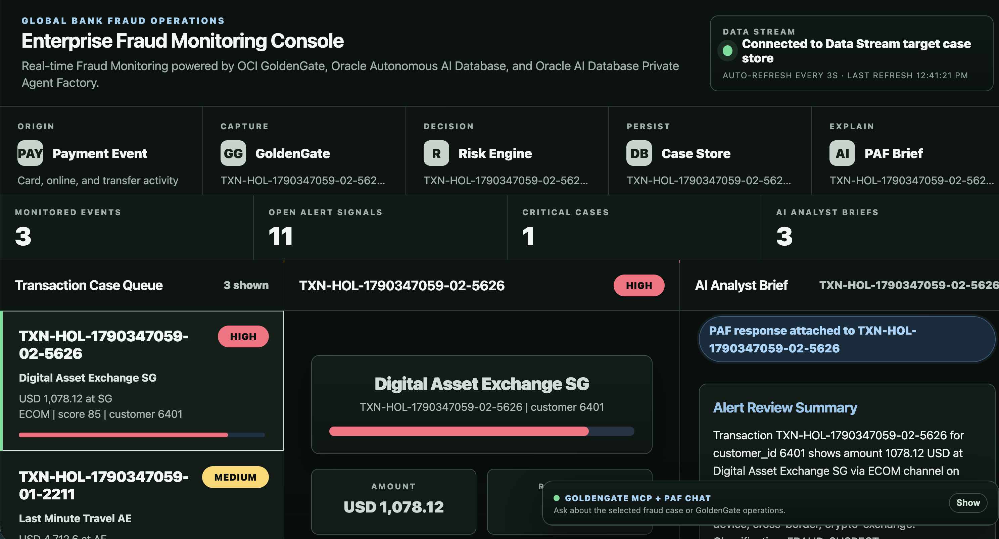

# Lab 5: Verify the complete fraud monitoring pipeline

## Introduction

In this lab, you correlate the same transaction across capture, delivery, storage, risk scoring, and AI analysis. The results on the Enterprise Fraud Monitoring Console should be traceable to a payment you inserted in the previous lab. 

Estimated time: 15 minutes.

### Objectives

In this lab, you will:

- Find a newly generated transaction in the Enterprise Fraud Monitoring Console.
- Review its payment details, risk score, and case status.
- Review the Oracle AI Database Private Agent Factory (PAF) analyst brief for the same transaction.
- Distinguish live results from old sample data or fallback explanations.

### Prerequisites

- This lab assumes that you completed all preceding labs.
- You recorded at least one transaction ID from the current run.
- The Extract `EXFRAUD` and Data Stream `FraudTxnStream` are running. 

## Task 1: Follow the event path

1. Open the **Enterprise Fraud Monitoring Console**.
   - Find the Fraud dashboard URL on the __LiveLabs Sandbox login page__.
   - Copy and paste it in your laptop browser and connect to the Enterprise Fraud Monitoring Console.

2. Wait for the transactions to appear in the dashboard.

**NOTE**: Do not rerun the script immediately if the dashboard is not up to date yet. First confirm that the inserts completed, then allow some time for the Extract and Data Stream to complete.

Use this path to understand the expected flow:

```text
Source Oracle Autonomous AI Database -> Extract EXFRAUD -> Trail ft -> Data Stream FraudTxnStream -> Python bridge -> Target case store -> PAF published agent -> OCI GenAI -> Stored analyst brief -> Dashboard
```

A Python bridge processes the Data Stream event, applies the demonstration risk rules, writes case information, and invokes the published PAF AI Agent for an explanation. The AI response is stored and displayed in the Enterprise Fraud Monitoring Console for the corresponding transaction.

## Task 2: Review the transactions in the Enterprise Fraud Monitoring Console

1. Return to the **Enterprise Fraud Monitoring Console** and allow time for processing.
2. Once the dashboard is open, subsequent data should appear automatically.
3. Find a transaction ID recorded in Lab 4.
4. Select the transaction and verify:

   - The transaction ID begins with `TXN-HOL-` and matches your source record.
   - The payment amount, merchant, and customer information match the source event.
   - The risk score and risk level are displayed.
   - The case status is shown where applicable.
   - A PAF-generated analyst brief is displayed for the same transaction ID when the event is eligible.

Low-risk transactions may not create an open fraud case or trigger an AI brief if the configured threshold excludes them. Use an eligible high-risk event from the supplied DML set to validate the analyst brief.

The following image shows a successful validation run. Event and alert counts vary between runs; use it to recognize the connected pipeline and an attached PAF brief, not as fixed expected counts.



## Task 3: Read the analyst brief

Expected sections include:

```text
## Alert Review Summary
## Why It Is Suspicious or Normal
```

followed by:

```text
## Evidence Summary
## Recommended Analyst Action
## Case Attachment
```

Check that the explanation cites the selected transaction's actual amount, merchant, country flow, channel, device, and supplied risk signals. Exact wording may vary depending on the Large Language Model (LLM) being used.

## Task 4: Observe automatic refresh

1. Leave the **Enterprise Fraud Monitoring Console** open.
2. Run the `run_fraud_sql_events.sh` script once more from the opened Terminal in noVNC.
3. Watch for the new transaction IDs without manually reloading the page.
4. Verify that the selected case and displayed brief continue to refer to the same transaction.

You may now __proceed to the next lab__.
